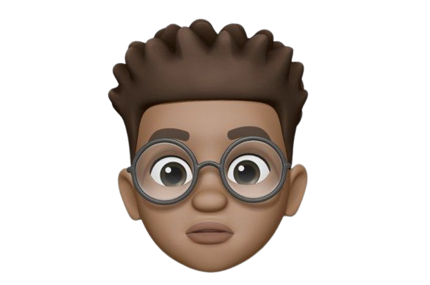

  

# Tomiwa David

Founder, designer, and builder creating thoughtful brands and useful products.

[Website](https://daaysorn.com) · [Instagram](https://www.instagram.com/daaysorn) · [X](https://x.com/daaysorn) · [Email](mailto:david@daaysorn.com)

## Hello

I turn ideas into clear experiences people can understand, trust, and enjoy. My work brings together how a brand feels, how a product looks, and how people use it.

My product spans across software and engineering, the Internet of Things, ecommerce, clothing, and meals. Every product follows the daaysorn design system so the experience stays clear, familiar, and consistent.

I am also a Christian, growing in faith with [CCI Global](https://joincci.org/).

## What I am building

- [Software and Engineering](https://daaysorn.com/software-and-engineering), useful software and carefully made tools
- [Internet of Things](https://daaysorn.com/internet-of-things), connected devices for the physical world
- [Ecommerce](https://daaysorn.com/ecommerce), simple shopping experiences
- [Clothing](https://daaysorn.com/clothing), everyday pieces shaped by comfort and character
- [Meals](https://daaysorn.com/meals), food ideas and experiences made for sharing

One daaysorn account is designed to give people access across every product, similar to how one Google Account works across Google services.

## Building in public

This repository contains the source for [daaysorn.com](https://daaysorn.com). I share how ideas become useful products, along with [daaysorn-cmp](https://github.com/daaysorn/daaysorn/tree/main/components/daaysorn-cmp), my collection of ready-made building blocks. It works with [shadcn/ui](https://ui.shadcn.com/), Next.js, React, Tailwind CSS, and registry-based installs. I use it to keep my products familiar, easy to use, and consistent wherever they appear.

I have made developer-ready integration guidance available in the [documentation](https://daaysorn.com/docs).

## Tools I enjoy

`Next.js` · `React` · `TypeScript` · `Tailwind CSS` · `GSAP` · `Design systems`

## Let us make something meaningful

If you have a brand to shape or a product worth making, [get in touch](mailto:david@daaysorn.com).
